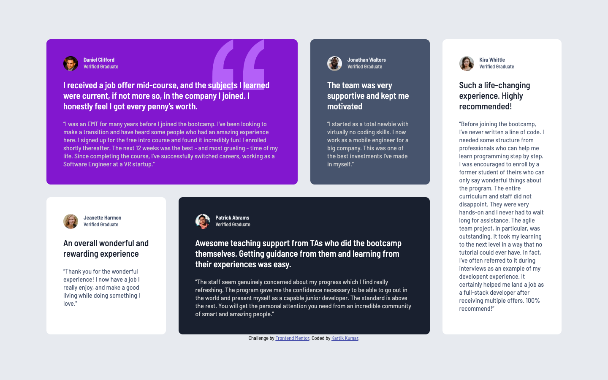

# Frontend Mentor - Testimonial grid section solution

This is a solution to the [Testimonials grid section challenge on Frontend Mentor](https://www.frontendmentor.io/challenges/testimonials-grid-section-Nnw6J7Un7). Frontend Mentor challenges help you improve your coding skills by building realistic projects. 

## Table of contents

- [Overview](#overview)
  - [The challenge](#the-challenge)
  - [Screenshot](#screenshot)
  - [Links](#links)
- [My process](#my-process)
  - [Built with](#built-with)
- [Author](#author)
- [Acknowledgments](#acknowledgments)

**Note: Delete this note and update the table of contents based on what sections you keep.**

## Overview

### The challenge

Users should be able to:

- View the optimal layout for the site depending on their device's screen size

### Screenshot

### Links

- Solution URL: [GitHub](https://github.com/kartik-kumar25/testimonial-grid-section.git)
- Live Site URL: [Live Site](https://kartik-kumar25.github.io/testimonial-grid-section/)

## My process

### Built with

- Semantic HTML5 markup
- CSS custom properties
- Flexbox
- CSS Grid
- Mobile-first workflow

## Author

- Frontend Mentor - [@kartik-kumar25](https://www.frontendmentor.io/profile/kartik-kumar25)
- GitHub - [@kartik-kumar25](https://github.com/kartik-kumar25)

## Acknowledgments

A huge thank you to Frontend Mentor for the amazing project prompts and designs. Their challenges gave me the perfect opportunity to practice my coding and build this real-world application.
